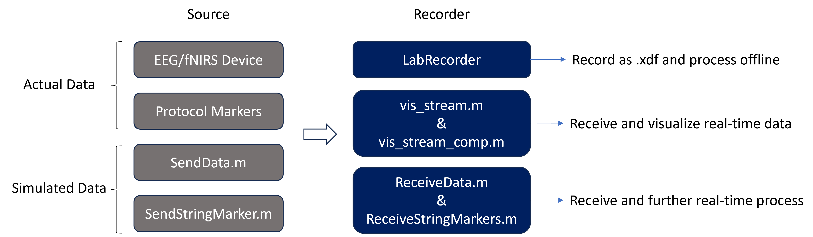

# LSL Matlab Cheatbook

# Description

LSL enables you to stream and record data in real-time.

This will be the toolbox for script template after you finish the [tutorial](https://github.com/sccn/labstreaminglayer/wiki/Tutorial). It also explain the common scripts such as streaming data/markers and receive data/markers.

# File list

- **LSL Matlab** *[MATLAB_Importer/liblsl-Matlab/examples/]*
    - core code about stream, receive data or markers
    - **make sure to add this folder and its subfolder to Matlab Path variables**
- **LabRecorder *[**LabRecorder/]*
    - the software that records and save all the streaming signal as .xdf file
- xdf Matlab reader *[xdf_reader_Matlab/]*:
    - decode the .xdf file and load on Matlab
- Matlab Viewer *[MATLAB_Importer/]*
    - generate realtime interface to visualize the incoming data
- AudioCapture *[AudioCapture/]*
    - a software that can stream sound
- Keyboard & Mouse Capture *[LSL_Keyboard_Mouse_Input/]*
    - softwares that can stream keyboard action or mouse button/position

# Basic Layout



# Core code

## Stream data (SendData.m)

- use your Matlab as a streaming input. This input will be stream to LabRecorder
- This is not quite common for actual measurement. However it can be used as a simulated realtime data input.

Three steps:

1. Load the library
2. Define an LSL stream information, create an outlet
3. Push data into the outlet

```matlab
%% Step1: instantiate the library
disp('Loading library...');
lib = lsl_loadlib();

%% Step2: make a new stream outlet
% lsl_streaminfo(lib, [stream name], [stream type], [channel number], [sampling rate],[channel format], [source id])
disp('Creating a new streaminfo...');
info = lsl_streaminfo(lib,'BioSemi','EEG',8,100,'cf_float32','sdfwerr32432');

disp('Opening an outlet...');
outlet = lsl_outlet(info);

%% Step3: send data into the outlet, sample by sample
disp('Now transmitting data...');
while true
    outlet.push_sample(randn(8,1));
    pause(0.01);
end
```

## Send Markers (SendStringMarker.m)

- generate a marker(event) stream
- this could be used to send event markers to the lab recorder.
- For example, insert this script in your own protocol script. Insert this code in your portocol, when you run your protocol, it will send event marker.

Three steps:

1. Load library
2. Create an LSL marker stream
3. Push data into the outlet

```matlab
%% Step1: instantiate the library
disp('Loading library...');
lib = lsl_loadlib();

%% Step2: make a new stream outlet
% the name (here MyMarkerStream) is visible to the experimenter and should be chosen so that 
% it is clearly recognizable as your MATLAB software's marker stream
% The content-type should be Markers by convention, and the next three arguments indicate the 
% data format (1 channel, irregular rate, string-formatted).
% The so-called source id is an optional string that allows for uniquely identifying your 
% marker stream across re-starts (or crashes) of your script (i.e., after a crash of your script 
% other programs could continue to record from the stream with only a minor interruption).
disp('Creating a new marker stream info...');
info = lsl_streaminfo(lib,'MyMarkerStream','Markers',1,0,'cf_string','myuniquesourceid23443');

disp('Opening an outlet...');
outlet = lsl_outlet(info);

%% Step3: send markers into the outlet
% modify this section to send specific markers at specific time
disp('Now transmitting data...');
markers = {'Test', 'Blah', 'Marker', 'XXX', 'Testtest', 'Test-1-2-3'};
while true
    pause(rand()*3);
    mrk = markers{min(length(markers), 1+floor(rand()*(length(markers))))};
    disp(['now sending ' mrk]);
    outlet.push_sample({mrk});   % note that the string is wrapped into a cell-array
end
```

## Receive Data (ReceiveData.m)

- directly receive data with Matlab instead of LabRecorder
- Use and modify this code if you want to further process the incoming data instead of directly save them.

Three steps:

1. Load library
2. resolve a stream: meaning detecting the incoming stream
    - lsl_resolve_byprop():
        - find the incoming steam through type or name
        - type:
            
            ```matlab
            while isempty(result)
                result = lsl_resolve_byprop(lib,'type','Markers');
            ```
            
        - name:
            
            ```matlab
            while isempty(result)
                result = lsl_resolve_byprop(lib,'name','MousePosition');
            ```
            
3. Creat an inlet, and pull the incoming data sample

```matlab
%% Step1: instantiate the library
disp('Loading the library...');
lib = lsl_loadlib();

%% Step2: resolve a stream...
disp('Resolving an EEG stream...');
result = {};
while isempty(result)
    result = lsl_resolve_byprop(lib,'type','Audio'); end

%% Step3: create a new inlet
disp('Opening an inlet...');
inlet = lsl_inlet(result{1});

disp('Now receiving data...');
while true
    % get data from the inlet
    [vec,ts] = inlet.pull_sample();
    % and display it
    fprintf('%.2f\t',vec);
    fprintf('%.5f\n',ts);
end
```

## Receive Markers (ReceiveStringMarkers.m)

- similar to receive data, directly receive markers with Matlab instead of LabRecorder
- Use and modify this code if you want to receive the markers on Matlab

Three steps:

1. Load library
2. resolve a stream: meaning detecting the incoming stream
    - lsl_resolve_byprop(): same as receive data section
        - find the incoming steam through type or name
        - type:
            
            ```matlab
            while isempty(result)
                result = lsl_resolve_byprop(lib,'type','Markers');
            ```
            
        - name:
            
            ```matlab
            while isempty(result)
                result = lsl_resolve_byprop(lib,'name','MousePosition');
            ```
            
3. Creat an inlet, and pull the incoming data sample
    - mrks{1} is the marker string

```matlab
%% Step1: instantiate the library
addpath(genpath('./../../liblsl-Matlab/'))
disp('Loading the library...');
lib = lsl_loadlib();

%% Step2: resolve a stream...
disp('Resolving a Markers stream...');
result = {};
while isempty(result)
		% This line is different from sending data stream (1/2)
    result = lsl_resolve_byprop(lib,'type','Markers'); end

%% Step3: create a new inlet
disp('Opening an inlet...');
inlet = lsl_inlet(result{1});

disp('Now receiving data...');
while true
    % get data from the inlet
    [mrks,ts] = inlet.pull_sample();
    % and display it
		% This line is different from sending data stream (2/2)
    fprintf('got %s at time %.5f\n',mrks{1},ts);
end
```

## Visualize the stream

### vis_stream.m

[*MATLAB_Importer\liblsl-Matlab\]*

After run it, open an gui and visualize the selected stream.


### vis_stream_comp.m

[*MATLAB_Importer\liblsl-Matlab\]*

directly call the vis_stream function and visualize the selected stream.

Example:

```matlab
vis_stream_comp('samplingrate 200 refreshrate 5 position [100,100,500,500]');
```

## Example: ReceiveData_keyboard_and_audio_YX.m

Receive Data when receiving Markers

```matlab
% instantiate the library
disp('Loading the library...');
lib = lsl_loadlib();

% resolve a data stream...
disp('Resolving a Data stream...');
result_1 = {};
while isempty(result_1)
    result_1 = lsl_resolve_byprop(lib,'name','MyAudioStream'); end

% create a new data inlet
disp('Opening a data inlet...');
data_inlet = lsl_inlet(result_1{1});

% resolve a marker stream...
disp('Resolving a marker stream...');
result_2 = {};
while isempty(result_2)
    result_2 = lsl_resolve_byprop(lib,'type','Markers'); end

% create a new marker inlet
disp('Opening a marker inlet...');
marker_inlet = lsl_inlet(result_2{1});

disp('Now receiving data...');
while true
    % get data from the inlet
    [pos,ts] = data_inlet.pull_sample();
    % and display it
    fprintf('%.2f\t',pos);
    fprintf('%.5f\n',ts);
    [mrks,ts] = marker_inlet.pull_sample();
    % and display it
    fprintf('got %s at time %.5f\n',mrks{1},ts);
end
```